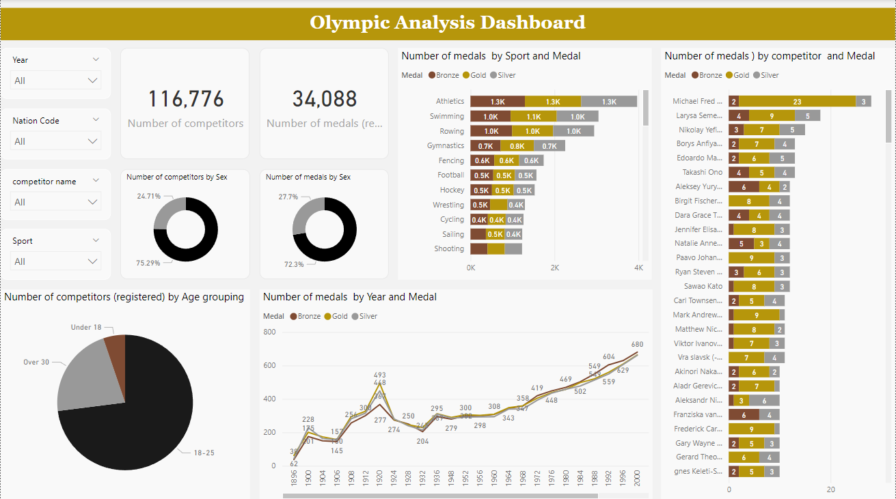
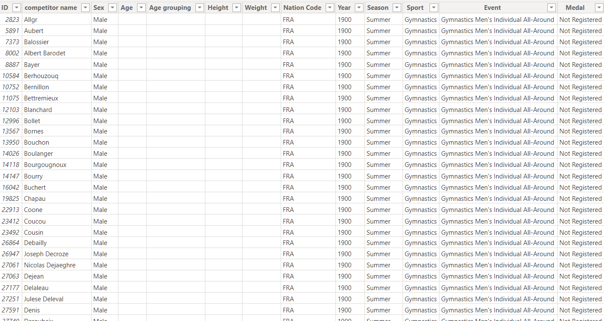
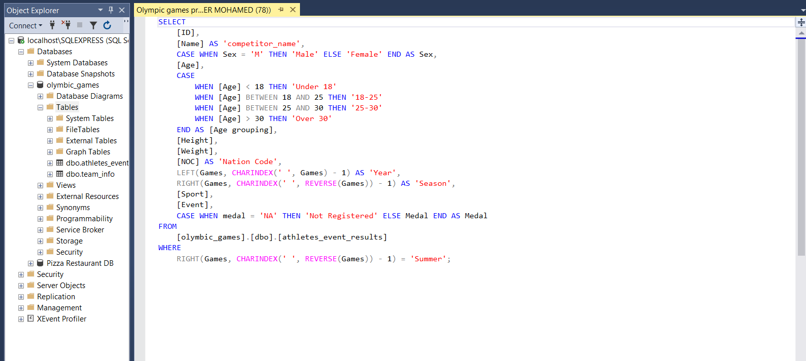

# Table of Contents
1.**Introduction**
1.**Overview Dashboard**
3.**Dataset**
4.**SQL the data**
5.**Usage**

# Intoduction
The project aims to analyze the 'Olympic Games' dataset to derive insights and facilitate data-driven decision-making for anyone interested in data analysis and dashboards.

# Overview Dashboard

**Olympic Games Analysis using SQL + Power BI**

This project addresses another businees problem In this context, I see myself as a data analyst employed at a news company. The task involves visualizing data to help readers comprehend how countries have historically performed in the Summer Olympic Games. 📈🥇
To resolve this business problem, I followed several steps:-
♦️ *Imported the dataset into SQL Server*
♦️ *Analyzed and cleaned the data using SQL queries*
♦️ *Connected Power BI to the SQL server*
♦️ *Uploaded the final dataset to Power BI*
♦️ *Typed my DAX calculations*
♦️ *Visualized the data, presenting information on the number of competitors and medals, sports, gender of the competitors, etc.*
♦️ *Ensured that the visualization is readable for stakeholders and readers*
While I believe this project is not overly complex, it offers a wealth of valuable information and establishes a solid foundation for readers and stakeholders interested in the Olympic games. 🙌

# Dataset

The dataset, named olympic_games, contains the following columns:

♦️ID: Competititor ID

♦️Competitor name: name of the competitor

♦️Sex

♦️Age

♦️Age grouping: To which age group does the competitor belong? 

♦️Height

♦️Weight

♦️Nation Code

♦️Event: Event that the competitor Participate in it

♦️Medal: type of medal 

♦️... (and other attributes related to olympics)

# SQL the data
**Data Processing and cleaning SQL**
1. Filtering Data
2. Removing Unnecessary Columns
3. Data Type Conversion
4. Creating Calculated Column
5. Aggregating Data
6. Connect Power Bi to my msSQL

)

**SQL query**

# Usage

Project Tutorial :https://www.linkedin.com/feed/update/urn:li:activity:7129289243268399104/
